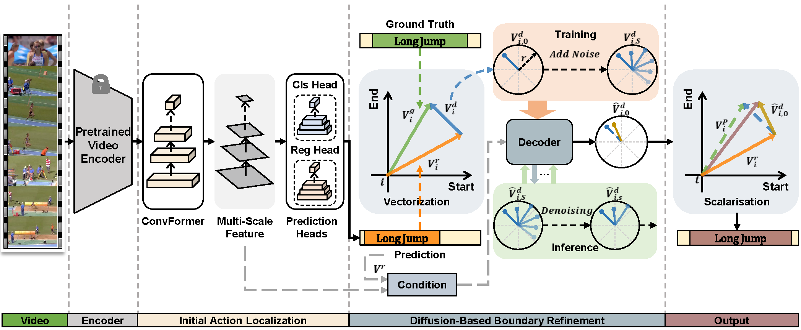

# DBR-TAD: Diffusion-Based Boundary Refinement for Temporal Action Detection

We provide the IAL model code as supplementary material and publish the DiffBR model code after acceptance of the paper.

## Overview



## Installation
+ Recommended Environment: python 3.8.8, Cuda11.6, PyTorch 1.12.1(The PyTorch version should be at least >= 1.11.)
+ Install dependencies: `pip install  -r requirements.txt`
+ Install NMS: `cd ./libs/utils; python setup.py install --user; cd ../..`

## Data
**Download Features and Annotations**
| Dataset  | Feature Encoder| Link |
|:-----------:|:-----------:|:------------:|
| THUMOS14 | I3D | [thumos_i3d](https://github.com/happyharrycn/actionformer_release/tree/main)|
| THUMOS14 | VideoMAE | [thumos_videomae](https://github.com/OpenGVLab/InternVideo/tree/main/Downstream/Temporal-Action-Localization)|
| ActivityNet | I3D | [anet_i3d](https://github.com/sauradip/tags)|
| ActivityNet | TSP | [anet_tsp](https://github.com/happyharrycn/actionformer_release/tree/main)|
| ActivityNet | VideoMAE | [anet_videomae](https://github.com/OpenGVLab/InternVideo/tree/main/Downstream/Temporal-Action-Localization)|
| Epic-Kitchen | SlowFast | [epic_kitchen](https://github.com/happyharrycn/actionformer_release/tree/main)|

**Unpack Features and Annotations**
+ Unpack the file under `./data`
+ The folder structure should look like
```
DAD-TAD/
  ├── data
  │   ├── anet_1.3
  │   │   ├── annotations
  │   │   ├── i3d_features
  │   │   ├── tsp_features
  │   │   └── anet_mae_hugek700
  │   ├── epic_kitchens
  │   │   ├── annotations
  │   │   ├── features
  │   └── thumos
  │   │   ├── annotations
  │   │   ├── i3d_features
  │   │   ├── th14_mae_g_16_4
  │   └── ... 
  ├── libs
  ├── tools
  └── ...
```

## Training and Evaluation
+ We have provided a script list that allows you to replicate our results with just a single click. Further details can be found in `./tools/run_all_exps.sh`.

+ Our experiments were conducted exclusively on a single NVIDIA GeForce GTX 1080 Ti. It is noted that variations in the graphics card model may lead to slight discrepancies in replicating the results.

+ [Optional] Monitor the training using TensorBoard. Example:
```
tensorboard --logdir=./ckpt/thumos_i3d_final/logs
```
